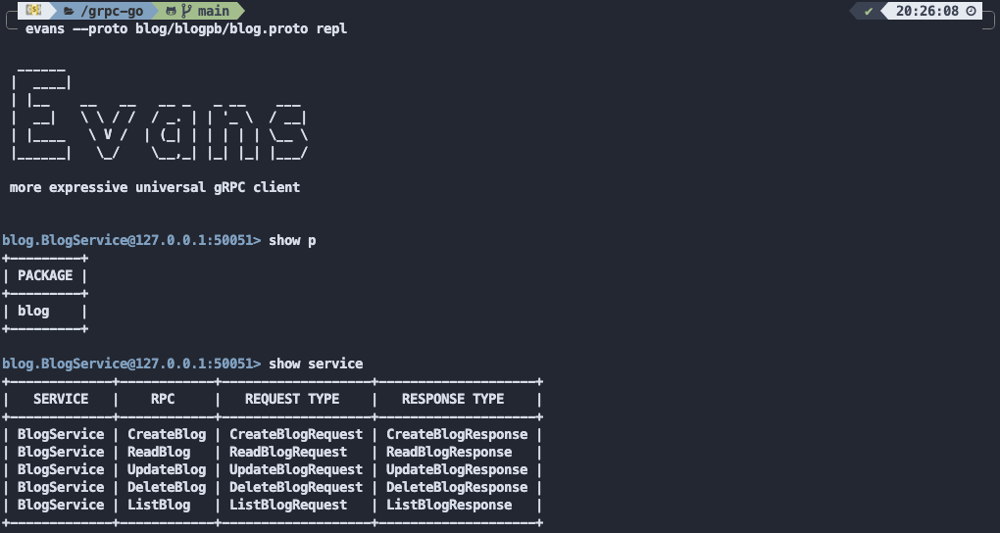

# Implementation of gRPC with Go

The module ([`github.com/grpc/grpc-go`](https://github.com/grpc/grpc-go))
contains the Go language implementation of gRPC. HTTP/2 based RPC with instruction

The blog ([`grpc.io/core-concepts`](https://grpc.io/docs/what-is-grpc/core-concepts/)) contains the introduction to key gRPC concepts, with an overview of gRPC architecture and RPC life cycle

## gRPC vs REST

[This blog](https://husobee.github.io/golang/rest/grpc/2016/05/28/golang-rest-v-grpc.html) finds that gRPC is <strong>25 times more performant</strong> than REST API (as defined as time to have the response for an specific API)


## Protocol Buffers

The module ([`github.com/golang/protobuf`](https://pkg.go.dev/mod/github.com/golang/protobuf))
contains Go bindings for Protocol Buffers

The documentation and tutorials by Google can be found at [`Protocol Buffers Go tutorials`](https://developers.google.com/protocol-buffers/docs/gotutorial)

My repository for Go bindings for Protocol Buffers instruction and theory can be found at [`github.com/minhtran241/protocol_buffers_go_generate`](https://github.com/minhtran241/protocol_buffers_go_generate)

## gRPC with Go

Follow the module ([`github.com/grpc/grpc-go`](https://github.com/grpc/grpc-go)) to install compiler and packages supporting gRPC with Go

To generate gRPC services for your application:

-   Update your PATH so that the protoc compiler can find the plugins
    ```sh
    PATH="${PATH}:${HOME}/go/bin"
    ```
-   Generate services:
    ```sh
    protoc --go-grpc_out=require_unimplemented_servers=false:. ./yourpath/to.protofile/*.proto
    ```

## Demo Application applied gRPC with Go

The application contains:

-   The demo of 4 main types of RPCs

    -   Unary RPCs
    -   Server Streaming RPCs
    -   Client Streaming RPCs
    -   Bi-Directional Streaming RPCs
    -   Blog Service with MongoDB

-   gRPC Error Handling

    -   How gRPC deals with error can be found at [`grpc.io/docs/guides/error`](https://grpc.io/docs/guides/error/)
    -   Reference to implementation oof error codes can be found at [`avi.im/grpc-errors/#go`](https://avi.im/grpc-errors/#go)
    -   If an application needs to return extra information on top of an error code,it can use the metadata context

-   gRPC Deadlines

    -   Deadlines allow gRPC clients to specify how long they are willing to wait for an RPC to complete before the RPCis terminated with the error `DEADLINE_EXCEEDED`
    -   The gRPC documentation recommends you set a deadline for all client RPC calls
    -   Setting the Deadlines is up to you, how long do you feel your API should have to complete?
    -   The server should check if the deadline has exceeded and cancel the work it is doing
    -   `defer cancel()` calls the `cancel()` function when the deadline has exceeded
    -   This blog describe Deadlines in depth [`grpc.io/blog/deadlines`](https://grpc.io/blog/deadlines/)
    -   Note: Deadlines are propagated across if gRPC calls are chained
    -   A => B => C (Deadline for A is passed to B and then passed to C)

-   SSL Encryption in gRPC

    -   SSL encryption is done by generating SSL certificates
    -   SSL allows communication to be secure end-to-end and ensuring no `Man in the middle attack` can be performed
    -   SSL allows clients and servers to encrypt packet
    -   Routers can not view the content of the internet packets
    -   TLS (Transport Layer Security)
        -   Successor of SSL, encrypts the connection between 2 endpoints for secure data exchange
    -   Two ways of using SSL (gRPC can use both)
        -   1-way verification, e.g. browser => WebServer
        -   2-way verification, e.g. SSL authentication
    -   Detailed Setup of SSL for Encryption

    

    -   All steps and command lines are noted in file `ssl/instructions.sh`
    -   All the configuration for generating SSL certificates is specified in file `ssl/ssl.cnf`
    -   Using `SHA256` algorithm for authentication

-   gRPC Reflection & CLI

    -   Why gRPC Reflection?
        -   As we've seen, for Clients to connect to our Server, they need to have a `.proto` file which defines the service
        -   This is fine for production (we definitely want to know the API definition in advance)
        -   For development, when you have a gRPC server you don't know, we have to know what APIs the server has
        -   Reflection is the solution
    -   Reflection helps us
        -   Having servers "expose" which endpoints are available
        -   Allowing CLI to talk to our server without have a preliminary `.proto` file
    -   This project uses the [evans](`https://github.com/ktr0731/evans`) REPL to practice on the client side
    -   To register server reflection on a gRPC server:

        ```sh
        import "google.golang.org/grpc/reflection"

        s := grpc.NewServer()
        pb.RegisterYourOwnServer(s, &server{})

        // Register reflection service on gRPC server.
        reflection.Register(s)

        s.Serve(lis)
        ```

    -   More information about gRPC Reflection can be found at [`pkg.go.dev/google.golang.org/grpc/reflection`](https://pkg.go.dev/google.golang.org/grpc/reflection#section-readme)

## Blog Service with MongoDB

-   The Blog Service contains 5 RPCs (4 Unary RPCs and 1 Server Streaming RPC)
-   CRUD services
-   Database

    -   Find more information about MongoDB Driver for Go at [`github.com/mongodb/mongo-go-driver`](https://github.com/mongodb/mongo-go-driver)
    -   Installation
        ```sh
        go get go.mongodb.org/mongo-driver/mongo
        ```
    -   MongoDB runs on `localhost:27017`

## Project Usage

-   The project contains services
    -   Greeting Service
    -   Calculator Service
    -   Blog Service
-   Start Demo (run all the services respectively)
    -   Start the server of one service
        ```sh
        go run service/service_server/server.go
        ```
    -   Start the client of one service
        ```sh
        go run service/service_client/client.go
        ```
-   Play with the services by using [`ktr0731/evans`](https://github.com/ktr0731/evans) REPL mode

    -   Installation
        -   MacOS
            ```sh
            brew tap ktr0731/evans
            brew install evans
            ```
    -   Usage
        -   Go to the one of the services you want to play with and trigger `evans` in REPL mode
            ```sh
            evans --proto service/service_pb/service.proto repl
            ```
        -   Follow the instructions of [`ktr0731/evans`](https://github.com/ktr0731/evans)

    

## Contributor

-   Minh Tran (Me)
